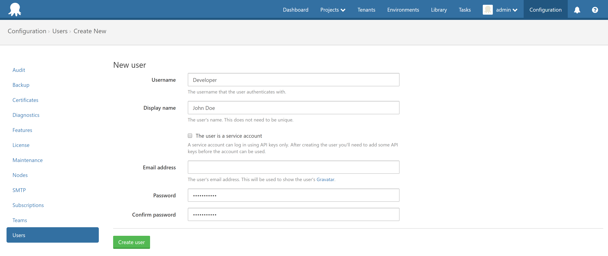
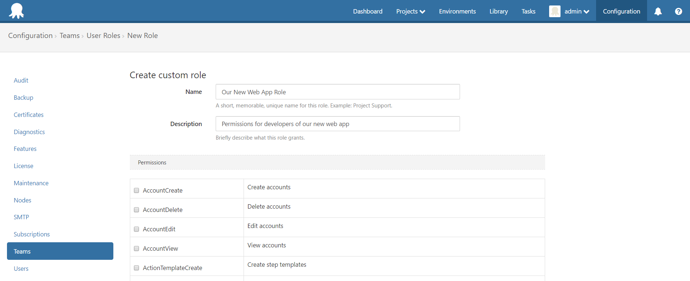
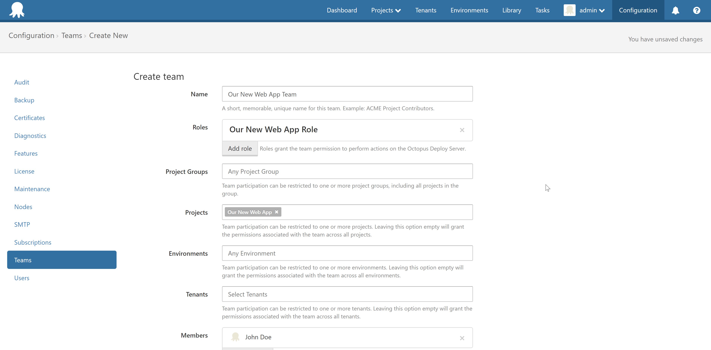
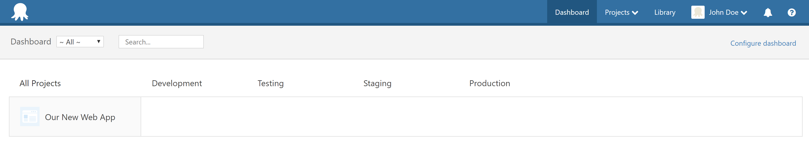

### Example Scenario
We have a team that should be dedicated to a specific project. They should be able to create and edit anything to do with this project (i.e. deployment process, variables, channels, etc.). To accomplish this, we'll follow these steps.

1. Create a custom role and assign it specific permissions. We can also use built-in user roles as shown in our [User Roles page](https://octopus.com/docs/administration/managing-users-and-teams/user-roles).
2. Create a new user.
2. Create a new team, scoping it to a specific project, and assign this new role and user to it.

### Process

1. First, we'll create a new user in *Configuration > Users* page in the web portal.

2. We'll then create a custom role and giving it the following permissions. This will by default give access to all projects. We'll scope the team to our single project in the next step.

This is the list of permissions we will assign to this role.

- EnvironmentView
- ProcessEdit
- ProcessView
- ProjectEdit
- ProjectView
- ReleaseCreate
- ReleaseDelete
- ReleaseEdit
- ReleaseView
- TriggerEdit
- TriggerView
- VariableEdit
- VariableEditUnscoped
- VariableView
- VariableViewUnscoped

:::hint
This can be simplified by using the following [built-in user roles](https://octopus.com/docs/administration/managing-users-and-teams/user-roles).
Project Deployer - All project contributor permissions, plus: deploying releases, but not creating them.
Project Lead - All project contributor permissions, plus: creating releases, but not deploying them.
:::

3. Now let's create a new team to assign our role and user to. We'll give it the same name as the project these users will have access to. We'll also scope our team to a specific project.

Now let's look at the results from this new user's perspective. You'll see that they can view all of the environments, but they can only see the specific project.

I hope this provides some good insight as to how permissions, roles and teams work together. Considering the other scoping options available which we haven't used, you can see the potential of how granular you can define permissions for your users.
